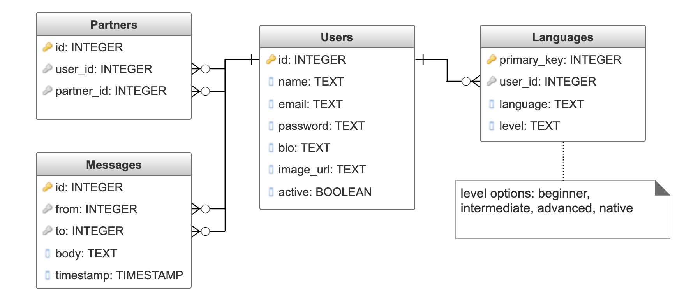
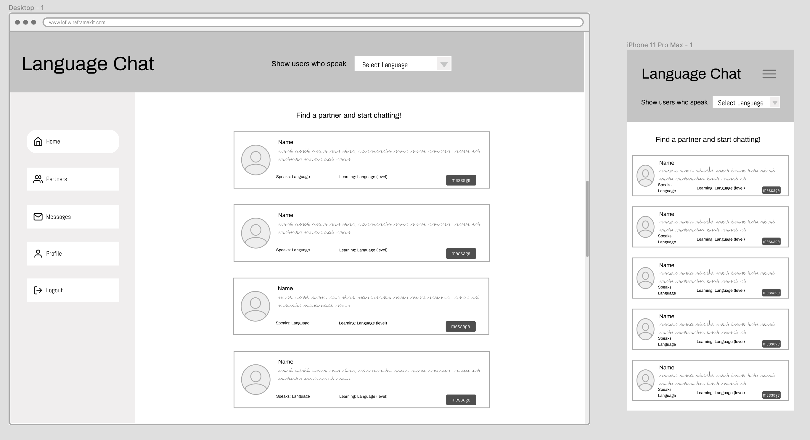

# Capstone Proposal

## Website Goal
The aim is for this site to helps users connect with people to practice speaking and writing in the language they're learning. Users will list the languages they speak fluently and the languages they want to practice and can filter users by this criteria to find practice partners. Users can send messages to each other and join live text or video chats on the site.
 

## User Demographics 
The target demographic is anyone learning a foreign language.

## API
I will be building the API for handling user data and messages with Node.js and Express. 
## Back End Outline

### Database Schema

### Tech Stack
* Node.js
* Express
* PostgreSQL
* Socket.io

### Endpoints
API documentation: [https://app.swaggerhub.com/apis-docs/blakely/lang-chat/1.0.0](https://app.swaggerhub.com/apis-docs/blakely/lang-chat/1.0.0)

### Sensitive Information
* passwords will be hashed with bcrypt
* JWTs will be used to authenticate users

## Front End Outline
### Tech Stack
* React
* Redux
* Socket.io
* SASS

### Basic User Flow
* When user registers they will indicate their native language, and what language or languages they want to practice
* When logged in a user can view the list of other users with short bio and the languages they speak and are learning
* The user list can be filtered by language preferences
* A user can send a message to any user and if they are currently online, join a live chat
* A user can add other users to their contacts

### Wireframes
#### Main Page Layout

[All page views](https://www.figma.com/file/yiMozoECcj0uvCkzkC5nGN/Language-Chat-Wireframe?node-id=1%3A5647)

## Deployment
* CircleCI
* Docker
* AWS ECS

## Stretch goals
* Implement video chat using webRTC
* Allow a user to block another user

